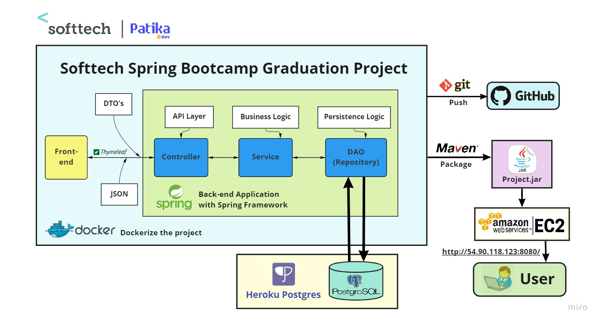

<!-- PROJECT LOGO -->
<br />
<div align="center">
  <a href="https://softtech.com.tr">
    
  </a>

<h3 align="center">Softtech Spring Bootcamp Guraduation Project</h3>

  <p align="center">
    <a href="https://www.patika.dev/bootcamp/softtech-java-spring-bootcamp"><strong>More about bootcamp »</strong></a>
    <br />
    <br />
    <a href="https://github.com/165-Softtech-Patika-Java-Spring/bitirmeprojesi-UyCoder/blob/main/BitirmeProjesiTalepleri.md">Project Requirements</a>
    ·
    <a href="https://github.com/165-Softtech-Patika-Java-Spring/bitirmeprojesi-UyCoder/blob/main/BitirmeProjesiHazirlikDokumani.pdf">Project Prapration Doc</a>
    ·
    <a href="http://3.84.212.13:8080/">View Demo</a>
  </p>
</div>


# Table of contents

* [About The Project](#About-The-Graduation-Project)
    + [Project Requirements](#Project-Requirements)
* [Project Prepration Documents](#Project-Prepration-Documents)
* [Project Structure](#Project-Structure)
    + [Database](#Databse,-Tables-and-columns)
    + [Demo](#demo)
    + [Swagger Documentation](#Swagger-Documentation)
    + [Technologies](#Technologies)
    + [Dependencies](#Dependencies)
    + [File Structure](#File-Structure)
* [Reference](#Reference)
    + [Articles](#Articles)
    + [Videos](#Videos)
* [Acknowledgments](#Thank-you-all)
    + [Patika](#To-Patika)
    + [Softtech](#To-Softtech)
    + [Teacher](#To-Teacher)
    + [Attendees](#To-Attendees)
* [License](#license)
* [Contact me](#Contact-me)


## About The Graduation Project
This is a graduation project for Softtech Spring Bootcamp. The Graduation Project was given at the end of the 5th week in this bootcamp. It is a project that'll ensures that the subjects we learned during this bootcamp are reinforced with the technologies used by the sponsor company Softtech. [](https://softtech.com.tr/) .

### Project Requirements
[The requirements for this project is here in Turkish](https://github.com/165-Softtech-Patika-Java-Spring/bitirmeprojesi-UyCoder/blob/main/BitirmeProjesiTalepleri.md)


### Project Prepration Documents
[The Project Prepration Documents in Turkish](https://github.com/165-Softtech-Patika-Java-Spring/bitirmeprojesi-UyCoder/blob/main/BitirmeProjesiHazirlikDokumani.pdf)

<p align="right">(<a href="#Table-of-contents">Table of Contents</a>)</p>

## Project Structure


### Databse, Tables and columns
I used PostgreSQL for the Databse of this project and here is the tables and columns:


### Demo
[Project Demo link](http://3.84.212.13:8080/)

### Screenshots of the user interface:
  

<details>
<summary><strong>Show more</strong></summary>
  

  

  

  

  

  

  


</details>


### Swagger Documentation
[Swagger-UI link](http://3.84.212.13:8080/swagger-ui/index.html?configUrl=/v3/api-docs/swagger-config#/)

### Screenshots for swagger file 


<details>
 <summary><strong>Show more</strong></summary>
  
 
  

  
</details>

### Technologies
- [Spring](https://spring.io/)
- [PostgreSQL](https://www.postgresql.org/)
- [Hibernate](https://hibernate.org/)
- [Lombok](https://projectlombok.org/)
- [Swagger-UI](https://swagger.io/tools/swagger-ui/)
- [SpringSecurity](https://spring.io/projects/spring-security)
- [JWT](https://jwt.io/)
- [Thymeleaf](https://www.thymeleaf.org/)
- [HTML](https://html.com/)
- [Bootstrap](https://getbootstrap.com/)
- [Docker](https://www.docker.com/)
- [AWS EC2](https://aws.amazon.com/ec2/)
- [Heroku](https://www.heroku.com/)
- [Git](https://git-scm.com/)
- [Maven](https://maven.apache.org/)

### Tools:
- [Intellj IDEA](https://www.jetbrains.com/idea/)
- [Postman](https://www.postman.com/)
- [pgAdmin for PostgreSQL ](https://www.pgadmin.org/) 
- [Docker Desktop](https://www.docker.com/products/docker-desktop/)
- [Git Windows GUI](https://git-scm.com/downloads)

<p align="right">(<a href="#Table-of-contents">Table of Contents</a>)</p>

### Dependencies
I used Maven as a dependency management framework. Here is how I configured the pom.xml file:
<details>
<summary><strong>Show more</strong></summary>

```xml
<?xml version="1.0" encoding="UTF-8"?>
<project xmlns="http://maven.apache.org/POM/4.0.0" xmlns:xsi="http://www.w3.org/2001/XMLSchema-instance"
         xsi:schemaLocation="http://maven.apache.org/POM/4.0.0 https://maven.apache.org/xsd/maven-4.0.0.xsd">
  <modelVersion>4.0.0</modelVersion>
  <parent>
    <groupId>org.springframework.boot</groupId>
    <artifactId>spring-boot-starter-parent</artifactId>
    <version>2.6.4</version>
    <relativePath/> <!-- lookup parent from repository -->
  </parent>
  <groupId>dev.ahmed</groupId>
  <artifactId>graduationproject</artifactId>
  <version>0.0.1-SNAPSHOT</version>
  <name>graduationproject</name>
  <description>graduationproject</description>
  <properties>
    <java.version>17</java.version>
    <org.mapstruct.version>1.4.2.Final</org.mapstruct.version>
  </properties>
  <dependencies>
    <dependency>
      <groupId>org.springframework.boot</groupId>
      <artifactId>spring-boot-starter-data-jpa</artifactId>
    </dependency>

    <dependency>
      <groupId>org.springframework.boot</groupId>
      <artifactId>spring-boot-starter-thymeleaf</artifactId>
    </dependency>

    <dependency>
      <groupId>org.springframework.boot</groupId>
      <artifactId>spring-boot-starter-hateoas</artifactId>
    </dependency>
    <dependency>
      <groupId>org.springframework.boot</groupId>
      <artifactId>spring-boot-starter-validation</artifactId>
    </dependency>
    <dependency>
      <groupId>org.springframework.boot</groupId>
      <artifactId>spring-boot-starter-web</artifactId>
    </dependency>
    <dependency>
      <groupId>org.springframework.boot</groupId>
      <artifactId>spring-boot-devtools</artifactId>
      <scope>runtime</scope>
      <optional>true</optional>
    </dependency>

    <dependency>
      <groupId>org.postgresql</groupId>
      <artifactId>postgresql</artifactId>
      <scope>runtime</scope>
    </dependency>

    <dependency>
      <groupId>org.mapstruct</groupId>
      <artifactId>mapstruct</artifactId>
      <version>${org.mapstruct.version}</version>
    </dependency>
    <dependency>
      <groupId>org.mapstruct</groupId>
      <artifactId>mapstruct-processor</artifactId>
      <version>${org.mapstruct.version}</version>
    </dependency>

    <dependency>
      <groupId>org.projectlombok</groupId>
      <artifactId>lombok</artifactId>
      <optional>true</optional>
    </dependency>

    <dependency>
      <groupId>org.springdoc</groupId>
      <artifactId>springdoc-openapi-ui</artifactId>
      <version>1.5.13</version>
    </dependency>

    <!--        <dependency>-->
    <!--            <groupId>org.thymeleaf</groupId>-->
    <!--            <artifactId>thymeleaf-spring5</artifactId>-->
    <!--        </dependency>-->
    <!--        <dependency>-->
    <!--            <groupId>org.webjars</groupId>-->
    <!--            <artifactId>bootstrap</artifactId>-->
    <!--            <version>4.3.1</version>-->
    <!--        </dependency>-->
    <dependency>
      <groupId>org.webjars</groupId>
      <artifactId>webjars-locator-core</artifactId>
    </dependency>

    <!--        <dependency>-->
    <!--            <groupId>org.springframework.boot</groupId>-->
    <!--            <artifactId>spring-boot-starter-security</artifactId>-->
    <!--        </dependency>-->
    <!--        <dependency>-->
    <!--            <groupId>io.jsonwebtoken</groupId>-->
    <!--            <artifactId>jjwt</artifactId>-->
    <!--            <version>0.9.1</version>-->
    <!--        </dependency>-->
    <dependency>
      <groupId>org.springframework.boot</groupId>
      <artifactId>spring-boot-starter-test</artifactId>
      <scope>test</scope>
    </dependency>
  </dependencies>

  <build>
    <plugins>
      <plugin>
        <groupId>org.springframework.boot</groupId>
        <artifactId>spring-boot-maven-plugin</artifactId>
        <configuration>
          <excludes>
            <exclude>
              <groupId>org.projectlombok</groupId>
              <artifactId>lombok</artifactId>
            </exclude>
          </excludes>
        </configuration>
      </plugin>
    </plugins>
  </build>

</project>


```
</details>


<p align="right">(<a href="#Table-of-contents">Table of Contents</a>)</p>

### File Structure
<details>
<summary><strong>Show more</strong></summary>

```bash
tree /f
Graduation Project
│  BitirmeProjesiHazirlikDokumani.pdf
│  BitirmeProjesiTalepleri.md
│  README.md
└─graduationproject
    │  .gitignore
    │  graduationproject.iml
    │  HELP.md
    │  mvnw
    │  mvnw.cmd
    │  pom.xml
    │
    ├─.mvn
    │  └─wrapper
    │          maven-wrapper.jar
    │          maven-wrapper.properties
    │
    ├─src
    │  ├─main
    │  │  ├─java
    │  │  │  └─dev
    │  │  │      └─ahmed
    │  │  │          └─graduationproject
    │  │  │              │  GraduationprojectApplication.java
    │  │  │              │
    │  │  │              ├─app
    │  │  │              │  ├─configs
    │  │  │              │  │      AppMvcConfig.java
    │  │  │              │  │
    │  │  │              │  ├─controller
    │  │  │              │  │  │  CategoryController.java
    │  │  │              │  │  │  ProductController.java
    │  │  │              │  │  │  UserController.java
    │  │  │              │  │  │
    │  │  │              │  │  └─frontendcontroller
    │  │  │              │  │          IndexController.java
    │  │  │              │  │          TableController.java
    │  │  │              │  │
    │  │  │              │  ├─converter
    │  │  │              │  │      CategoryDetailsMapper.java
    │  │  │              │  │      UserMapper.java
    │  │  │              │  │
    │  │  │              │  ├─dao
    │  │  │              │  │      CategoryDao.java
    │  │  │              │  │      ProductDao.java
    │  │  │              │  │      UserDao.java
    │  │  │              │  │
    │  │  │              │  ├─dto
    │  │  │              │  │      CategoryDto.java
    │  │  │              │  │      CategoryFindAllDetailsDto.java
    │  │  │              │  │      CategoryUpdateKdvDto.java
    │  │  │              │  │      ProductDto.java
    │  │  │              │  │      ProductSaveRequestDto.java
    │  │  │              │  │      ProductUpdatePriceDto.java
    │  │  │              │  │      UserDto.java
    │  │  │              │  │      UserLoginDto.java
    │  │  │              │  │      UserResponseDto.java
    │  │  │              │  │      UserSaveRequestDto.java
    │  │  │              │  │      UserUpdateRequestDto.java
    │  │  │              │  │
    │  │  │              │  ├─entity
    │  │  │              │  │      Category.java
    │  │  │              │  │      Product.java
    │  │  │              │  │      User.java
    │  │  │              │  │
    │  │  │              │  ├─enums
    │  │  │              │  ├─exception
    │  │  │              │  │      CategoryAlreadyExistsException.java
    │  │  │              │  │      CategoryNotFoundException.java
    │  │  │              │  │      ProductAlreadyExistsException.java
    │  │  │              │  │      ProductNotFoundException.java
    │  │  │              │  │      UserAlreadyExistsException.java
    │  │  │              │  │      UserNotFoundException.java
    │  │  │              │  │
    │  │  │              │  ├─service
    │  │  │              │  │  │  Service.java
    │  │  │              │  │  │
    │  │  │              │  │  └─entityservice
    │  │  │              │  │          CategoryEntityService.java
    │  │  │              │  │          ProductEntityService.java
    │  │  │              │  │          UserEntityService.java
    │  │  │              │  │
    │  │  │              │  └─util
    │  │  │              └─gen
    │  │  │                  ├─dto
    │  │  │                  │      RestResponse.java
    │  │  │                  │
    │  │  │                  ├─entity
    │  │  │                  │      BaseAdditionalFields.java
    │  │  │                  │      BaseEntity.java
    │  │  │                  │      BaseModel.java
    │  │  │                  │
    │  │  │                  ├─enums
    │  │  │                  │      BaseErrorMessage.java
    │  │  │                  │      GenErrorMessage.java
    │  │  │                  │      GenStatusType.java
    │  │  │                  │
    │  │  │                  ├─exception
    │  │  │                  │      GenCustomizedResponseEntityExceptionHandler.java
    │  │  │                  │      GenExceptionResponse.java
    │  │  │                  │
    │  │  │                  ├─exceptions
    │  │  │                  │      GenBusinessException.java
    │  │  │                  │      ItemNotFoundException.java
    │  │  │                  │
    │  │  │                  ├─service
    │  │  │                  │      BaseEntityService.java
    │  │  │                  │
    │  │  │                  └─util
    │  │  │                          DateUtil.java
    │  │  │
    │  │  └─resources
    │  │      │  application.properties
    │  │      │  banner.txt
    │  │      │
    │  │      ├─static
    │  │      │  ├─css
    │  │      │  │      app.css
    │  │      │  │      app.css.map
    │  │      │  │      style.css
    │  │      │  │
    │  │      │  ├─img
    │  │      │  │  │  ProjectStructure.jpg
    │  │      │  │  │  softtech_logo-1.png
    │  │      │  │  │  softtech_logo.png
    │  │      │  │  │
    │  │      │  │  ├─avatars
    │  │      │  │  │      avatar.jpg
    │  │      │  │  │
    │  │      │  │  └─icons
    │  │      │  │          icon-48x48.png
    │  │      │  │
    │  │      │  └─js
    │  │      │          app.js
    │  │      │          app.js.LICENSE.txt
    │  │      │          app.js.map
    │  │      │
    │  │      └─templates
    │  │          │  404.html
    │  │          │  addcategory.html
    │  │          │  addproduct.html
    │  │          │  categories.html
    │  │          │  details.html
    │  │          │  edituser.html
    │  │          │  login.html
    │  │          │  main.html
    │  │          │  signup.html
    │  │          │  updateproduct.html
    │  │          │  updateuser.html
    │  │          │
    │  │          └─table
    │  └─test
    │      └─java
    │          └─dev
    │              └─ahmed
    │                  └─graduationproject
    │                      │  GraduationprojectApplicationTests.java
    │                      │
    │                      └─app
    │                          ├─controller
    │                          │      CategoryControllerTest.java
    │                          │      ProductControllerTest.java
    │                          │      UserControllerTest.java
    │                          │
    │                          └─service
    │                              └─entityservice
    │                                      CategoryEntityServiceTest.java
    │                                      ProductEntityServiceTest.java
    │                                      UserEntityServiceTest.java
    │
    └─target
        │  graduationproject-0.0.1-SNAPSHOT.jar
        │  graduationproject-0.0.1-SNAPSHOT.jar.original
```

</details>
<p align="right">(<a href="#Table-of-contents">Table of Contents</a>)</p>

## Reference
These are the links of readings and video turorials I used when I work on this project.

### Articles
- https://www.baeldung.com/thymeleaf-in-spring-mvc
- https://www.baeldung.com/spring-boot-crud-thymeleaf
- https://www.baeldung.com/spring-cloud-heroku
- https://devcenter.heroku.com/articles/deploying-spring-boot-apps-to-heroku

### Videos
- https://www.youtube.com/playlist?list=PLLCTYkJ1vsDBYoOxOjNY7f6yiQLL7rbab
- https://www.youtube.com/playlist?list=PLmOn9nNkQxJFKh2PMfWbGT7RVuMowsx-u
- https://www.youtube.com/watch?v=9SGDpanrc8U
- https://www.youtube.com/watch?v=5Bj1ZEvsTWI
- https://www.youtube.com/watch?v=g5oI0sIUmB0


<p align="right">(<a href="#Table-of-contents">Table of Contents</a>)</p>

## Thank you all
### To Patika
Many thanks to the team of  who organized this bootcamp. I believe they are now doing very god job for Turkey's technological development. <strong>Thank You for your efforts!</strong>👏🏻
### To Softtech
Special thanks to [](https://softtech.com.tr/) for sponsorship. I hope you will succeed in your business🎯 to become the biggest IT company in Turkey.
### To Teacher
I would like to express my respect and appreciation to our teacher, <strong>*Sadık Bahadır Memiş*</strong>, who trained us with his valuable experience and help us to learn this wonderful technology Spring. 👏🏻
### To Attendees
Thank you everyone for participating. It was a pleasure to be in the same bootcamp with you. <strong>I wish you success in your life!💪</strong> I hope there will be a chance to continue our career together in the same development team.☕️

<p align="right">(<a href="#Table-of-contents">Table of Contents</a>)</p>

## Contact me
I wish we will keep in touch with each other later. 
<br/>
You can find me there: </br>
[](https://www.linkedin.com/in/ahmed-bughra/) [](https://github.com/Uycoder)
[](https://www.hackerrank.com/ahmedbughra)  [](https://stackoverflow.com/users/16111723/ahmad-ali)

<p align="right">(<a href="#Table-of-contents">Table of Contents</a>)</p>
